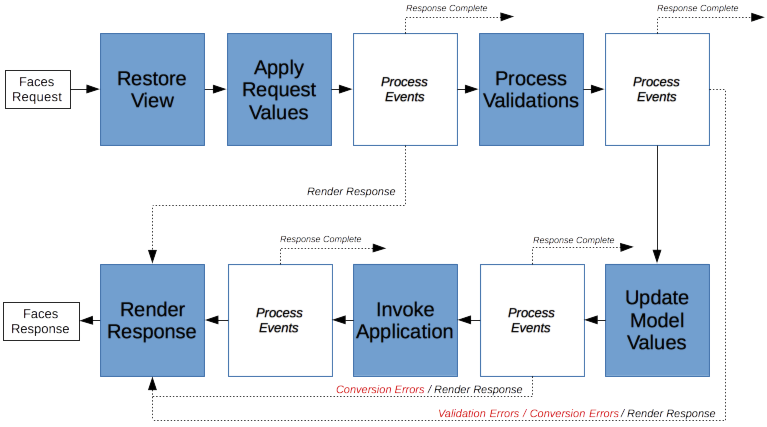
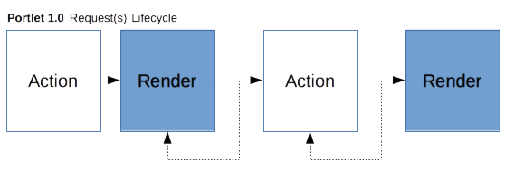
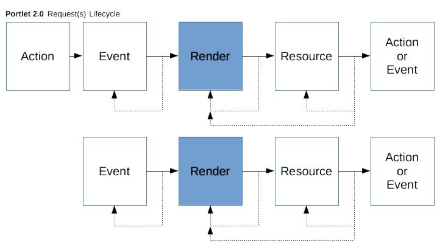
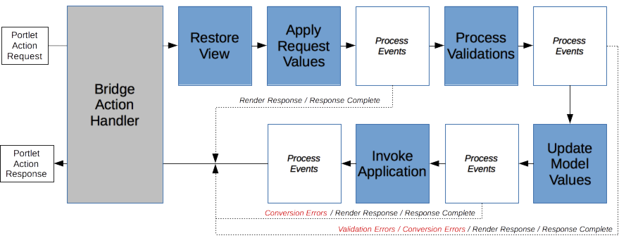
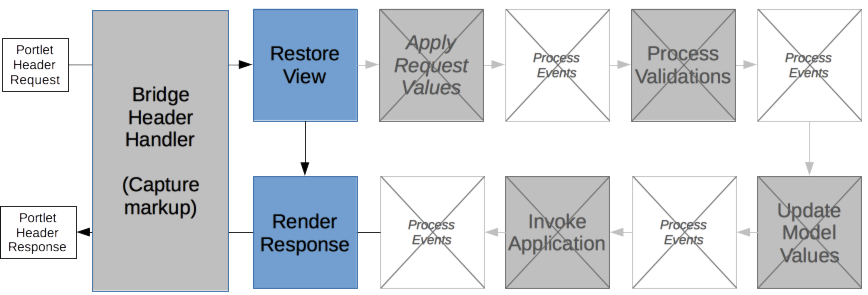
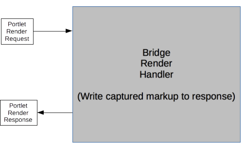

_Version: 6.0.0-edr1-SNAPSHOT_

# 5. Request Lifecycle

* * *

When an incoming portlet request is recognized as one that should be processed by Faces, the portlet executes it by
calling the bridge's `doFacesRequest` method. When executing the request, the bridge is responsible for setting up the
appropriate Faces environment, executing the appropriate portions of the Faces lifecycle, and managing the resulting
view and managed bean state in a manner that is consistent with the Faces specification. The bridge's implementation
provides this behavior without impacting Faces ability to (simultaneously) process requests coming in via the servlet
container and by coexisting with any of the many Faces extensions that might also be configured in this application.

## 5.1 Request Lifecycle

Bridge request processing maps between the portlet and Faces models within a well defined Faces execution flow. This
entails managing differences between lifecyle processing.

### 5.1.1 Bridge Request Lifecycle

Faces has a single request lifecycle primarily split between action (data processing) and rendering. The action portion
of the lifecycle is broken into four distinct (sub) phases that move the submitted data from the request into the data
models and performs the intended action (based on this new state). The render portion of the lifecycle is a single (sub)
phase in which the view markup is generated based on the application's recomputed state. The initial (sub) phase of the
lifecyle is an initialization phase that restores the target view based on incoming request data.

Figure 2 depicts the non-portlet Faces lifecycle where both the action is processed and the view is rendered within a
single client request.

Like the Portlet 1.0 model, the Portlet 2.0/3.0 model has a multi-request lifecycle primarily split between action (data
processing) and rendering. The main difference is that the Portlet 2.0/3.0 model provides a richer set of operations. In
Portlet 1.0 data processing was limited to those instigated by the client. Such actions were expressed in requests
handled by the portlet's `processAction` method. Likewise rendering occurred in a single request handled by the
portlet's `render` method. Within a given lifecycle, such renders might be repeated as the consumer (portal) reacquires
the current markup. This usually occurs as a result of processing external to this portlet causing the consuming
application to regenerate the markup for the entire page.

In Portlet 2.0/3.0, data processing has been expanded to include events sent by the consumer application (usually as a
result of another portlet raising an event). These are processed in the portlet's `processEvent` method. Now a lifecycle
can begin either with a `processAction` or a `processEvent`. And because events can be chained within a single
lifecycle, a `processEvent` can be followed by zero or more `processEvents` prior to moving into the render portion of
the lifecycle. Likewise the Portlet 2.0/3.0 rendering model is enriched by including support for portlet's rendering
resources. The rendering portion of a Portlet 1.0/2.0 lifecycle always begins with a call to the portlet's `render`
method. In Portlet 3.0, the rendering portion begins in the `renderHeaders` method before `render` is called.  This can
be followed by zero or more resource requests. Since rendering is supposed to be idempotent, this portion of the
lifecycle may repeat over and over until a new action or event causes the start of the next lifecycle. Figure 3 depicts
the difference between the Portlet 1.0, 2.0, and 3.0 models:

The key difference between the Faces model and the portlet model is that Faces typically executes completely within a
single request while portlets execute each phase of its lifecycle in distinct requests. Faces relies on this single
request execution using request scoped managed state created during the action phase to render from. This doesn't work
in the portlet environment as the phases are run in distinct requests and hence request scoped state is not carried
across. A key function of the bridge is managing this Faces request scoped state across the varying portlet requests
that constitute a lifecyle.

Figure 3 depicts the Faces lifecycle as executed in a portlet environment for a portlet that just responds to action and
render requests. In response to a portlet action request, the Faces action lifecycle is executed but the resulting view
is not rendered. Rather the bridge encodes in the action response the information it needs to subsequently render the
view when called by the portlet to render. Following an action, one or more portlet render requests may be executed.
Each of these render requests, if running in the same action scope, renders the same response. The bridge manages the
necessary Faces state to ensure this behavior.

Like render, event processing runs using the bridge managed request scope. When an event is received, the scope in which
it is related is restored. If no scope exists a new one is created. The Faces "action" lifecycle is run to restore the
view but since a portlet event doesn't include POSTBACK data the other phases are skipped. The event is processed by a
portlet provided event handler whose result (can) contain a Faces navigation. If returned, the navigation is processed
and encoded. The current request state is preserved within the (existing) scope in case it has been modified and the
event response returned. For situations when an event signals an application transition where it becomes necessary to
clear all or some of the existing scope, the portlet must to this manually by removing the appropriate request scope
attributes within its event handler. The details on managing this execution are described below in section
[5.2.5](chapter-5-request-lifecycle.md#5.2.5).

Resource requests are an additional phase in the overall portlet render lifecyle. Following a render, one or more
resource requests are made to either acquire dependent resources to complete the rendition or update parts of the
existing rendition. As such, resource requests run within the same restored bridge managed request scope as its render
request. What is unique to resources, however, is they can be a POSTBACK. I.e. they can be a Faces view (form) submit
requesting a partial update and rendition and hence require the full Faces action lifecycle to be run. So like the event
processing described above, resource request handling also has to deal with saving changes to the restored scope so that
subsequent render requests will have complete and updated state. The details on managing this are describe below in
section [5.2.8](chapter-5-request-lifecycle.md#5.2.8).

### 5.1.2 Managing Lifecycle State

To support Faces, the bridge is responsible for encoding portlet (action) responses in a manner that allows it (and
Faces) to reestablish the request environment that existed at the end of the corresponding action phase during
subsequent header/render requests that are identified as pertaining to that action (or event). The term used to describe
the scope of this managed data is the **bridge request scope**. The bridge request scope manages two types of Faces
data: the Faces view state and the additional Faces request scope data Faces relies on when executing both the action
and the render in a single request. Though the Faces view state management is commonly delegated to the normal Faces
`StateManager` process, the bridge is responsible for ensuring that such state is not restored if it can't restore the
associated data. This additional associated data is called *scoped data* and
includes[[5.1](tck-tests.md#5.1)]:

- All the `FacesMessage`(s) for each component in the view containing such messages.
- The Faces request scope attributes returned by calling `ExternalContext.getRequestMap()` except for:

    - those that existed before the bridge acquired the `FacesContext` for this request
    - those explicitly excluded by mechanisms described in [5.1.2.1](chapter-5-request-lifecycle.md#5.1.2.1)
    - those whose value is an instanceof `javax.portlet.PortletConfig`, `javax.portlet.PortletContext`,
    `javax.portlet.PortletRequest`, `javax.portlet.PortletResponse`, `javax.portlet.PortletSession`,
    `javax.portlet.PortletPreferences`, `javax.portlet.PortalContext`, `javax.faces.context.FacesContext`,
    `javax.faces.context.ExternalContext`, `javax.servlet.ServletConfig`, `javax.servlet.ServletContext`,
    `javax.servlet.ServletRequest`, `javax.servlet.ServletResponse`, or `javax.servlet.HttpSession`.
    - those whose attribute name contains an identifier in either the "`javax.portlet`", "`javax.portlet.faces`",
    "`javax.faces`", "`javax.servlet`", or "`javax.servlet.include`" namespaces.
    - those added by the bridge implementation and are not needed in subsequent requests.
- The request parameter whose name is identified by `ResponseStateManger.VIEW_STATE_PARAM` (if it exists).
- All (additional) request parameters, if the `javax.portlet.faces.[portlet name].PRESERVE_ACTION_PARAMS`
`PortletContext` attribute exists and has a value of `TRUE`.

Specifically, the bridge must implement a notion of a bridge request scope that supplies the expected Faces semantics.
This is done as follows:

- For each portlet action ignore any references to an existing request scope. I.e. portlet action requests always define
the start of a new scope so never restore a preexisting one[[5.2](tck-tests.md#5.2)]. **Note**: if the
bridge uses such a scope itself to preserve internal information about the Faces view, such information may be extracted
and used as needed to satisfy the request. For example, if the bridge manages the view's view state, it would acquire
this information so that it may be used to fully restore the view during the action processing.
- Upon completion of each portlet action preserve the *scoped data* (described above) in a newly created bridge request
scope if the action doesn't terminate because of a redirect[[5.3](tck-tests.md#5.3)] or the navigational
target of the action doesn't specify a portlet mode that differs from the current
request[[5.4](tck-tests.md#5.4)]. Such state may either be managed directly in a scoped data structure or
indirectly by ensuring its use only occurs if the scope still exists. In addition the bridge must encode sufficient
information in the action response that allows it to reestablish the data in this scope in subsequent in-scope requests.
- For each portlet event, if a bridge request scope exists, restore its state to the current (container) request
scope[[5.48](tck-tests.md#5.48)], otherwise create a new scope.
- Upon completion of each portlet event preserve the *scoped data* (described above) into the preexisting scope if it
exists or otherwise a newly created bridge request scope unless the event processing issued a
redirect[[5.49](tck-tests.md#5.49)] or the navigational target of the event specifies a portlet mode that
differs from the current request[[5.50(tck-tests.md#5.50)]. Such state may either be managed directly in a
scoped data structure or indirectly by ensuring its use only occurs if the scope still exists. In addition the bridge
must encode sufficient information in the action response that allows it to reestablish the data in this scope in
subsequent in-scope requests.
- For each header request, if a bridge request scope exists, restore its state to the current (container) request
scope[[5.5](tck-tests.md#5.5)]. For any action parameters that have been preserved, the parameter is
restored if and only if there isn't an existing parameter of the same name in the incoming
request[[5.6](tck-tests.md#5.6)].
- Upon completion of each portlet render, do not preserve any changes in the request scope back into the bridge request
scope except those related to internal bridge operations (e.g. `VIEW_STATE_PARAM` management). In the portlet (and
Faces) model, render is supposed to be idempotent.
- For each resource request, if a bridge request scope exists, do not restore the scope into the current request rather
maintain a reference to the scope so new request scoped attributes can be merged back into the bridge request scope
after the lifecycle has run[[5.51](tck-tests.md#5.51)]. For any action parameters that have been preserved,
the parameters are cleared (preserving action parameters should not be used in conjunction with processing Faces
requests via portlet resource requests).
- Upon completion of each resource request, preserve the *scoped data* (described above) into the preexisting scope if
it exists or otherwise a newly created bridge request scope[[5.52](tck-tests.md#5.52)]. Such state may
either be managed directly in a scoped data structure or indirectly by ensuring its use only occurs if the scope still
exists. In addition the bridge must encode sufficient information in the action response that allows it to reestablish
the data in this scope in subsequent in-scope requests.

Notes:

- Under normal conditions, a bridge request scope must be maintained at least until the next action or event request (a
subsequent bridge request scope is established)[[5.8](tck-tests.md#5.8)]. The exception is when the bridge
manages this scope in its server and chooses to reclaim this state due to lack of use.
- The bridge must not assume that all requests following the establishment of a request scope (and prior to a subsequent
action) are executed in the same bridge request scope[[5.9](tck-tests.md#5.9)]. There are a variety of
reasons that subsequent header requests might reference differing request scopes including a mode change, processing a
bookmark(ed) page and consumer history management. Hence the bridge must manage this scope in a manner that ensures that
each request is encoded with sufficient information as to allow it to decode the specific scope targeted by the request.
- If a corresponding bridge request scope can't be located or restored then the bridge must ensure that none of the
state described above is restored. In particular, when relying on Faces to manage the view state, the bridge must ensure
that the view isn't restored from this state in the event the corresponding bridge request scope has been lost (doesn't
exist). This corresponds to ensuring that `ViewHandler.createView()` is used to establish the viewroot vs.
`ViewHandler.restoreView()`. This behavior should occur automatically as a by-product of not being able to restore the
request scope. The default Faces implementation relies on the value of the `ResponseStateManager.VIEW_STATE_PARAM`
request parameter and `ResponseStateManager.isPostback()` to determine whether a targeted view has corresponding state
to be restored. `ResponseStateManager.isPostback()` also depends on the `ResponseStateManager.VIEW_STATE_PARAM` request
parameter. As the bridge manages the `ResponseStateManager.VIEW_STATE_PARAM` request parameter in its request scope, not
restoring it should ensure the view is recreated.

**Note**: A straightforward implementation for managing the bridge request scope is identify the scope via a key stored
*as a portlet render parameter. However, because the portlet model doesn't allow the bridge to set new portlet render
*parameters in a resource request, it must use a different technique to manage the such a newly created scope until such
*time as the technique becomes available (next action or event).

#### 5.1.2.1 Excluding Attributes from the Bridge Request Scope

Though there is a long list of excluded attributes and objects cited in section
[5.1.2](chapter-5-request-lifecycle.md#5.1.2), the extended bridge request scope is inclusive. It includes application
request scoped attributes except those specific few it knows are controlled by the standard runtime containers. However,
there are times when application request attributes really are utilized on a per request basis and hence shouldn't be
managed by the extended bridge request scope. An example is a flag indicating which type of request this is. e.g. a flag
used during a partial page request. If this flag were to be preserved, all subsequent requests within this scope would
be marked as partial requests even if they are not. In addition to the attributes cited above, the bridge will exclude
from its request scope those attributes:

- whose object class is annotated with
`javax.portlet.faces.annotation.ExcludeFromManagedRequestScope`[[5.10a](tck-tests.md#5.10)]
- whose attribute name is listed as an excluded attribute using the `<bridge:excluded-attributes>` element structure
defined in the schema
[portlet2.0-bridge-faces1.2-faces-config-extensions.xsd](xsd/portlet2.0-bridge-faces1.2-faces-config-extensions.xsd)
when such element structure appears as a child of the `<application-extension>` element in any `faces-config.xml`
reachable by this web application[[5.10b](tck-tests.md#5.10)].

For example:

    <?xml version="1.0" encoding="windows-1252"?>
    <faces-config version="1.2" xmlns="http://java.sun.com/xml/ns/javaee"
        xmlns:bridge="http://www.apache.org/myfaces/xml/ns/bridge/bridge-extension">
        <application>
           <application-extension>
               <bridge:excluded-attributes>
                   <bridge:excluded-attribute>myFacesExtension.requestFlag</bridge:excluded-attribute>
                   <bridge:excluded-attribute>myFacesExtension.state.*</bridge:excluded-attribute>
               </bridge:excluded-attributes>
           </application-extension>    
        </application>
    </faces-config>

- whose attribute name is in the immediate namespace listed as a wildcard excluded attribute using the
`<bridge:excluded-attributes>` element structure defined in the schema
[portlet2.0-bridge-faces1.2-faces-config-extensions.xsd](xsd/portlet2.0-bridge-faces1.2-faces-config-extensions.xsd)
when such element structure appears as a child of the `<application-extension>` element in any faces-config.xml
reachable by this web application[[5.10c](tck-tests.md#5.10)].
- whose attribute name appears in the List object of excluded attributes in the portlet context attribute
`javax.portlet.faces.[portlet name].excludedRequestAttributes` and that portlet is the target of the current
request[[5.10d](tck-tests.md#5.10)].
- whose attribute name appears in the immediate namespace listed as a wildcard excluded attribute in the List object of
excluded attributes in the portlet context attribute `javax.portlet.faces.[portlet name].excludedRequestAttributes` and
that portlet is the target of the current request[[5.10e](tck-tests.md#5.10)].

#### 5.1.2.2 Considerations in Managing the VIEW_STATE_PARAM parameter

The value of the `VIEW_STATE_PARAM` request parameter identifies the view state to be restored by the targeted view.
From a Faces specification perspective this value is opaque, i.e. implementation dependent. Because the bridge manages
this parameter in its request scope, to properly support rerender within the same action (lifecycle), it must take care
to keep the value of this managed parameter in sync with both the current (render) view and the current (saved) state.
One strategy for handling this is for the bridge to implement and configure its own `StateManager` implementation. In
this implementation the bridge overrides the `writeState` method. It buffers the output of the delegated `writeState`
and parses the result to extract the corresponding new value of the `VIEW_STATE_PARAM` written into the markup. It then
updates the value of the `VIEW_STATE_PARAM` parameter maintained within the current bridge request scope, ensuring that
a subsequent rerender of this view in this scope will restore with the correct view state.

#### 5.1.2.3 Considerations for Managing Faces Messages

The JSF 1.2 specification, section 6.1.5 requires that the various FacesContext methods that get Messages return those
Messages in insertion order. The bridge must preserve this requirement while managing such Messages within the bridge
request scope[[5.11](tck-tests.md#5.11)].

## 5.2 Executing a Faces Request

The bridge is called by the portlet to execute Faces requests. A Faces request is one that targets a Faces view and
expects to have the Faces lifecycle executed within the Faces environment. The bridge acts as a Faces controller in a
portlet environment; it determines the Faces view target, acquires the appropriate Faces lifecycle and context objects,
restores managed lifecycle state, and executes the Faces lifecycle. This is done as follows:

### 5.2.1 Acquiring a Faces Lifecycle

To execute a Faces request within the portlet environment, the bridge uses the Faces `Lifecycle` object. The bridge must
get the `Lifecycle` object by calling a `LifecycleFactory`. The bridge must acquire the `LifecycleFactory` by calling
the Faces `FactoryFinder` passing the identifier `FactoryFinder.LIFECYCLE_FACTORY`. For example:

    LifecycleFactory lifecycleFactory =
        (LifecycleFactory) FactoryFinder.getFactory(FactoryFinder.LIFECYCLE_FACTORY);

Distinct `Lifecycle` implementations are identified by an identifier. The identifier used by the bridge to acquire a
`Lifecycle` object from the `LifecycleFactory` is determined by:

1. A `PortletContext` `initParameter` whose name is represented by the constant `FacesServlet.LIFECYCLE_ID_ATTR`. For
example:

        String lifecycleId =
            mPortletConfig.getPortletContext().getInitParameter(FacesServlet.LIFECYCLE_ID_ATTR);

2. If this `initParameter` doesn't exist or has an empty value then the default `Lifecycle` identifier is used:
`LifecycleFactory.DEFAULT_LIFECYCLE`.

### 5.2.2 Acquiring the FacesContext

For each `doFacesRequest` invocation processing a Faces target, the bridge must acquire a `FacesContext` object. The
bridge must acquire the FacesContext by calling the `FacesContextFactory`[[5.12](tck-tests.md#5.12)]. The
`FacesContextFactory` must be acquired by calling the `FactoryFinder` passing the identifier
`FactoryFinder.FACES_CONTEXT_FACTORY`. For example:

    FacesContextFactory contextFactory =
        (FacesContextFactory) FactoryFinder.getFactory(FactoryFinder.FACES_CONTEXT_FACTORY);

The `FacesContext` is acquired from the factory by passing the corresponding `PortletContext`, `PortletRequest`,
`PortletResponse` objects and the `Lifecycle` acquired in section
[5.2.1](chapter-5-request-lifecycle.md#5.2.1)[[5.13](tck-tests.md#5.13)]. For example:

    FacesContext context =
        contextFactory.getFacesContext(portletContext, portletRequest, portletResponse, mLifecycle);

#### 5.2.2.1 Identifying the Portlet Request Phase

Prior to acquiring the `FacesContextFactory` the bridge is required to set the following request attribute on the passed
request object[[5.14](tck-tests.md#5.14)]:

`javax.portlet.faces.phase`: The value of this attribute is an enumeration (`javax.portlet.faces.Bridge.PortletPhase`)
that identifies which portlet request phase the bridge is operating within. Its purpose is to allow Faces
implementations to determine its portlet execution context without using `instanceof`. It is not indicative of the Faces
lifecycle phases. Possible phase values for a portlet based on the Java Portlet Specification 2.0 (JSR 286) include:
`ACTION_PHASE`, `EVENT_PHASE`, `RENDER_PHASE`, and `RESOURCE_PHASE`. The value `ACTION_PHASE` must be set when
`doFacesRequest()` is passed an `ActionRequest` and `ActionResponse`. The value `EVENT_PHASE` must be set when
`doFacesRequest()` is passed an `EventRequest` and `EventResponse`. The value `HEADER_PHASE` must be set when
`doFacesRequest()` is passed a `HeaderRequest` and `HeaderResponse`. The value `RENDER_PHASE` must be set when
`doFacesRequest()` is passed a `RenderRequest` and `RenderResponse`. The value `RESOURCE_PHASE` must be set when
`doFacesRequest()` is passed an `ResourceRequest` and `ResourceResponse`.

### 5.2.3 Determining the Target View

To execute a Faces request, the bridge is responsible for determining the appropriate Faces `viewId` to target for this
request and presenting this information to the Faces environment such that it can determine and utilize this `viewId`.
There are three mechanisms the bridge uses for determining the target view:

1. The bridge is passed the target view by the portlet.
2. The bridge decodes the target view from information in the request it had encoded in a prior response.
3. The bridge uses a default view registered to it by the portlet during its initialization.

Specifically the bridge must process for the target view in the following order until a `viewId` is determined:

- If the request attribute named `javax.portlet.faces.viewId` is non-null then use this value as the target
viewId[[5.15](tck-tests.md#5.15)].
- If the request attribute named `javax.portlet.faces.viewPath` is non-null then use this value to process the
`ContextPath` relative path and extract the target `viewId`[[5.16](tck-tests.md#5.16)]. If unable to
extract a `viewId` from the path throw
`javax.portlet.faces.BridgeInvalidViewPathException`[[5.17](tck-tests.md#5.17)].
- If the bridge is processing for the target view in a header request which occurs in the same portlet mode following
another header request in which a redirect occurred and an action, event, or resource request hasn't been processed in
the meantime, use the target `viewId` from the prior redirect[[5.18](tck-tests.md#5.18)].

**Note**: depending on the methodology the bridge relies on to encode the target `viewId` in responses the bridge may
*need an alternative mechanism to handle this redirect during render requirement. For example, if the bridge encodes the
*target `viewId` in a portlet render parameter then it needs to implement a temporary in-memory cache for this redirect
*URL management as the portlet model doesn't allow changes to render parameters during a render response.

- If available, decode the target `viewId` from request information encoded by the bridge in a prior response. Use this
`viewId`, if and only if, the current portlet mode is the same as the portlet mode in which the `viewId` was encoded
into the response[[5.19](tck-tests.md#5.19)]. Details of such encoding/decoding are implementation
specific.
- Use the default viewId corresponding to the current portlet mode from the Map stored in the `PortletContext` attribute
`javax.portlet.faces.[portletName].defaultViewIdMap`. The `Map` is keyed by portlet mode name. If the bridge can't
locate a default `viewId` for the current portlet mode or that default is `null`, throw
`javax.portlet.faces.BridgeDefaultViewNotSpecifiedException`[[5.20](tck-tests.md#5.20)].

**Note**: In some circumstances a bridge may be able to determine that request doesn't represent a request for a Faces
target and was therefore inappropriately passed to it. In this circumstance the bridge may throw the
`javax.portlet.faces.BridgeNotAFacesRequestException` instead of resolving to the default `viewId`.

In a variety of the situations above, view information may optionally contain a query string. When a query string is
encountered the bridge must extract this information as part of its process of determining the viewId and expose the
parameters in this query string as additional request parameters[[5.21](tck-tests.md#5.21)].

To pass the `viewId` to the Faces environment, the bridge must present the information as if it were encoded directly in
the incoming request `URI` path. I.e. Faces encodes the target viewId in the path portion of the action `URLs` it is
instructed to manufacture. The bridge inserts itself in this process to transform such `URLs` into properly encoded
portlet action `URLs`. As part of this transformation the bridge encodes the original target information so that it can
reacquire it when the request is submitted. Upon receiving such a request, the bridge reverses the process by
determining the intended target and then presenting this information via the path information that existed in this
original URL. This is done by reverse engineering the `URI` paths from the `viewId` and providing this path information
to Faces via the appropriate `ExternalContext` methods. Such reverse engineering must take into account whether the
Faces servlet is prefix or suffix mapped and work correctly in both situations. [**Note**: the current version of the
Faces RI needs a workaround where one additionally sets this path information in the corresponding
"`javax.servlet.include`." attributes when reverse engineering indicates Faces is extension mapped].

It is recommended that this process of reverse engineering the paths from the bridge's stored `viewId` be done within
its `ExternalContext` implementation and not done when/where it executes the Faces lifecycle.

### 5.2.4 Executing a Portlet Action Request

The bridge processes a portlet action request when its `doFacesRequest` is called with the corresponding portlet Action
`request` and `response` objects:

    public void doFacesRequest(javax.portlet.ActionRequest request, javax.portlet.ActionResponse response);

The bridge should only be called to process an action request for a Faces target.

In processing this request the bridge must:

- throw the BridgeUninitializedException if the bridge isn't currently initialized (`init()` has been called following
either the bridge's construction or a prior `release()`)[[5.22](tck-tests.md#5.22)].
- set the `javax.portlet.faces.phase` request attribute to `Bridge.PortletPhase.ACTION_PHASE` prior to acquiring the
`FacesContext`[[5.23](tck-tests.md#5.23)].
- acquire the `FacesContext` and `Lifecycle` as described above ensuring the appropriate target `viewId` will be
processed [5.2.3](chapter-5-request-lifecycle.md#5.2.3).
- execute the action phase of the Faces lifecycle. This is accomplished by calling the execute method on the Lifecycle
object acquired in section [5.2.1](chapter-5-request-lifecycle.md#5.2.1). For example:

    lifecycle.execute(context);

Provide a `PhaseListener` that recognizes the `RESTORE_VIEW afterPhase`. Within this notification process any public
render parameters as per section [5.3.2](chapter-5-request-lifecycle.md#5.3.2).

- recognize whether Faces considers the current request processing complete (redirect occurred) or not. If its not
considered complete[[5.24](tck-tests.md#5.24)]:
    - cache the current ViewRoot in a manner that allows the bridge to restore this ViewRoot from the cache when the
    subsequent header request occurs. (**Note**: JSF 1.2's save mechanism can only be utilized during the rendering
    process.)
    - encode the ActionResponse in such a way so the bridge will be able to identify and restore the current view (as
    resulted from calling lifecycle.execute).
    - set new public render parameters from mapped models whose values have changed as per section
    [5.3.3](chapter-5-request-lifecycle.md#5.3.3).[[5.74](tck-tests.md#5.74)]
    - if the current view (of the action navigation) is a Faces view which doesn't indicate a need to switch from the
    current portlet mode then satisfy all requirements listed in section [5.1.2](chapter-5-request-lifecycle.md#5.1.2)
    concerning establishing and maintaining a bridge request scope with its corresponding state.
- release the FacesContext[[5.25](tck-tests.md#5.25)].
- remove the `javax.portlet.faces.phase` request attribute[[5.26](tck-tests.md#5.26)].

### 5.2.5 Executing a Portlet Event Request

The bridge processes a portlet event request when its `doFacesRequest` is called with the corresponding portlet Event
`request` and `response` objects:

    public void doFacesRequest(javax.portlet.EventRequest request, javax.portlet.EventResponse response);

The bridge should only be called to process an event if the portlet has initialized the bridge with a
`BridgeEventHandler` and the request is for a Faces target. In processing this request the bridge must:

- throw the BridgeUninitializedException if the bridge isn't currently initialized (`init()` has been called following
either the bridge's construction or a prior `release()`)[[5.53](tck-tests.md#5.53)].
- set the `javax.portlet.faces.phase` request attribute to `Bridge.PortletPhase.EVENT_PHASE` prior to acquiring the
`FacesContext`[[5.54](tck-tests.md#5.54)].
- sets the current non-public request render parameters on the response so they are preserved for the next
request[[5.55](tck-tests.md#5.55)].
- reestablish (if so indicated) the Faces request scope from the corresponding bridge request scope satisfying all
requirements listed in section [5.1.2](chapter-5-request-lifecycle.md#5.1.2) concerning providing an idempotent
rendition based on the `viewId` and request scope state referenced in the header
request[[5.48](tck-tests.md#5.48)].
- acquire the `FacesContext` and `Lifecycle` as described above ensuring the appropriate target `viewId` will be
processed [5.2.3](chapter-5-request-lifecycle.md#5.2.3). **Note**: if the event request follows an action request, the
Bridge will have to manually restore the view from its cache as it doesn't get saved by Faces until the subsequent
header request.
- execute the action phase of the Faces lifecycle up through but not beyond the `RestoreView` model phase. This is
accomplished by installing a `PhaseListener` which terminates processing after the `RestoreView` phase and calling the
`execute` method on the `Lifecycle` object acquired in section [5.2.1](chapter-5-request-lifecycle.md#5.2.1). For
example:

    lifecycle.execute(context);

Provide a `PhaseListener` that recognizes the `RESTORE_VIEW` `afterPhase`. Within this notification process any public
render parameters as per section [5.3.2](chapter-5-request-lifecycle.md#5.3.2).

- if the portlet has registered an event handler, call the event handler passing the `FacesContext` and the `Event`
retaining the returned `EventNavigationResult`[[5.56](tck-tests.md#5.56)].
- if FacesContext.responseComplete() isn't true (a redirect didn't occur during the lifecycle execution or event
handling):
    - if the `NavigationResult` returned from the event handler is non-null, acquire the applications
    `NavigationHandler` and call `handleNavigation()` passing the `fromAction` and `outcome` from the
    `NavigationResult`[[5.57](tck-tests.md#5.57)].
    - encode the ActionResponse in such a way so the bridge will be able to identify and restore the current view (as
    resulted from calling `handleNavigation()`).
    - set new public render parameters from mapped models whose values have changed as per section
    [5.3.3](chapter-5-request-lifecycle.md#5.3.3) [[5.58](tck-tests.md#5.58)].
    - if the current view (of the action navigation) is a Faces view which doesn't indicate a need to switch from the
    current portlet mode then satisfy all requirements listed in section [5.1.2](chapter-5-request-lifecycle.md#5.1.2)
    concerning establishing and maintaining a bridge request scope with its corresponding state.
- release the FacesContext[[5.59](tck-tests.md#5.59)].
- remove the javax.portlet.faces.phase request attribute[[5.60](tck-tests.md#5.60)].

If the bridge is called to process an event and it hasn't been initialized with a `BridgeEventHandler` then the bridge
only sets the current non-public request render parameters on the response so they are preserved for the next request
and then returns[[5.61](tck-tests.md#5.61)].

### 5.2.6 Executing a Portlet Header Request

The bridge processes a portlet header request when its `doFacesRequest` is
called with the corresponding portlet Header `request` and `response` objects:

    public void doFacesRequest(javax.portlet.HeaderRequest, javax.portlet.HeaderResponse response);

The bridge may be called to process a portlet header request for either a Faces target or a non-Faces target.

In processing this request for a Faces target the bridge must:

- throw the BridgeUninitializedException if the bridge isn't currently initialized (`init()` has been called following
either the bridge's construction or a prior `release()`)[[5.27](tck-tests.md#5.27)].
- set the `javax.portlet.faces.phase` request attribute to `Bridge.PortletPhase.HEADER_PHASE` prior to acquiring the
`FacesContext`[[5.28](tck-tests.md#5.28)].
- acquire the `FacesContext` and `Lifecycle` as described above ensuring the appropriate target `viewId` will be
processed [5.2.3](chapter-5-request-lifecycle.md#5.2.3).
- reestablish (if so indicated) the Faces request scope from the corresponding bridge request scope satisfying all
requirements listed in section [5.1.2](chapter-5-request-lifecycle.md#5.1.2) concerning providing an idempotent
rendition based on the `viewId` and request scope state referenced in the header
request[[5.30](tck-tests.md#5.30)].
- ensure the `RenderKits ResponseStateManager isPostback()` method returns true if and only if a bridge request scope
has been identified and restored[[5.31](tck-tests.md#5.31)]. **Note**: as indicated in section
[5.1.2](chapter-5-request-lifecycle.md#5.1.2) this is controlled by both restoring the value of the
`ResponseStateManager.VIEW_STATE_PARAM` parameter from the bridge request scope and setting the
`javax.portlet.faces.isPostback` attribute with a `Boolean` whose value is `true`.
- ensure the corresponding Faces `view` is (re)established for the targeted Faces `viewId`. This is accomplished by
calling the `execute` method on the `Lifecycle` object acquired in section
[5.2.1](chapter-5-request-lifecycle.md#5.2.1). For example:

    lifecycle.execute(context);

In meeting this requirement the bridge must:

- manually restore the view from its cache if the view hasn't yet been saved by
Faces[[5.32](tck-tests.md#5.32)].
- ensure that only the Faces `RestoreView` (if necessary) phases executes. I.e. the bridge must ensure that the Faces
action phases following the `RestoreView` phase are skipped[[5.33a](tck-tests.md#5.33)].
- ensure that all PhaseListeners listening on the before and after phase of the `PhaseId.RESTORE_VIEW` are
called[[5.33b](tck-tests.md#5.33)].
- provide a `PhaseListener` that recognizes the `RESTORE_VIEW afterPhase`. Within this notification process any public
render parameters as per section [5.3.2](chapter-5-request-lifecycle.md#5.3.2)
- execute the `render` phase of the Faces lifecycle[[5.34](tck-tests.md#5.34)]. This is accomplished by
calling the `render` method on the `Lifecycle` object acquired in section
[5.2.1](chapter-5-request-lifecycle.md#5.2.1). For example:

    lifecycle.render(context);

- recognize if a redirect occurs during this render process and handle by discarding any existing output, and rerunning
this process based on the new target and its request parameters (if the target has a query
string)[[5.35](tck-tests.md#5.35)].
- add `target="head"` resources, `@ResourceDependency` resources, and children of `h:head` to the `<head>` section of
the portal via `HeaderResponse.addDependency()`. If the resource has a JSF resource name, pass it to
`HeaderResponse.addDependency()` as the `name` argument. If the resource has a JSF resource library name, pass it to
`HeaderResponse.addDependency()` as the `scope` argument[[5.75](tck-tests.md#5.75)].
- capture any markup not related to the `<head>` section to be rendered during [the subsequent render
request](chapter-5-request-lifecycle.md#5.2.7)[[5.76](tck-tests.md#5.76)].
- if necessary, update the value of the `VIEW_STATE_PARAM` parameter managed in this bridge request
scope[[5.36](tck-tests.md#5.36)].
- release the `FacesContext`[[5.37](tck-tests.md#5.37)].
- remove the `javax.portlet.faces.phase request` attribute[[5.38](tck-tests.md#5.38)].

### 5.2.7 Executing a Portlet Render Request

The bridge processes a portlet render request when its `doFacesRequest` is
called with the corresponding portlet Render `request` and `response` objects:

    public void doFacesRequest(javax.portlet.RenderRequest, javax.portlet.RenderResponse response);

The bridge may be called to process a portlet render request for either a Faces target or a non-Faces target.

In processing this request for a Faces target the bridge must:

- write the markup captured by the bridge during the header request to the
response[[5.76](tck-tests.md#5.76)].

### 5.2.8 Executing a Portlet Resource Request

The bridge processes a portlet resource request when its `doFacesRequest` is called with the corresponding portlet
Resource `request` and `response` objects:

    public void doFacesRequest(javax.portlet.ResourceRequest request, javax.portlet.ResourceResponse response);

The bridge may be called to process a resource request for a Faces target or a non-Faces target.

In processing this request the bridge must:

- throw the BridgeUninitializedException if the bridge isn't currently initialized (`init()` has been called following
either the bridge's construction or a prior `release()`)[[5.62](tck-tests.md#5.62)].
- set the `javax.portlet.faces.phase` request attribute to `Bridge.PortletPhase.RESOURCE_PHASE` prior to acquiring the
`FacesContext`[[5.63](tck-tests.md#5.63)].

- If automatic resource dispatching is enabled and the request targets a non-Faces resource, acquire a portlet
`RequestDispatcher` and use `forward()` to render the resource[[5.64](TCK-Tests.md#5.64)]. Bridge
implementations may optionally perform security checks before acquiring the RequestDispatcher. Automatic resource
dispatching is enabled if the portlet developer has specified the following init-param in the portlet.xml descriptor:

    <init-param>
        <name>javax.portlet.automaticResourceDispatching</name>
        <value>true</value>
    </init-param>

- If the request targets a Faces resource:
    - acquire the `FacesContext` and `Lifecycle` as described above ensuring the appropriate target `viewId` will be
    processed [5.2.3](chapter-5-request-lifecycle.md#5.2.3).
    - do not reestablish the Faces request scope from the corresponding bridge request
    scope[[5.65](tck-tests.md#5.65)].
    - ensure the corresponding Faces `view` is (re)established for the targeted Faces `viewId`. This is accomplished by
    calling the `execute` method on the `Lifecycle` object acquired in section
    [5.2.1](chapter-5-request-lifecycle.md#5.2.1). For example:

            lifecycle.execute(context);

    Provide a `PhaseListener` that recognizes the `RESTORE_VIEW afterPhase`. Within this notification process any public
    render parameters as per section [5.3.2](chapter-5-request-lifecycle.md#5.3.2).
    
    - execute the `render` phase of the Faces lifecycle. This is accomplished by calling the `render` method on the
    `Lifecycle` object acquired in section [5.2.1](chapter-5-request-lifecycle.md#5.2.1). For example:

            lifecycle.render(context);

    - preserve any changes in the current request scope to the bridge request. Reuse the existing bridge request scope
    if it exists, otherwise create one[[5.66](tck-tests.md#5.66)].
    - release the FacesContext[[5.67](tck-tests.md#5.67)].
- remove the `javax.portlet.faces.phase` request attribute[[5.68](tck-tests.md#5.68)].

### 5.2.9 Releasing the FacesContext

If the bridge has acquired the FacesContext within a doFacesRequest call, it must release it before it returns
regardless of the disposition of the result. E.g.

    context.release();

## 5.3 Processing Public Render Parameters

The bridge automates the processing of public render parameters. A public render parameter can be mapped to an object's
accessor (get/set method) designed to handle a `String` representation of the value via a Faces `ValueExpression`. When
a new public render parameter value is received in a request, the bridge sets the value by calling the
`ValueExpression`'s `setValue()`. At the end of an action or event request, if the current value of any mapped public
render parameter doesn't match the current incoming value, the bridge sets the new value in an outgoing public render
parameter (if feasible in the given phase). The bridge doesn't directly support updating or removing a public render
parameter from its mapped model during either a render or resource request.

### 5.3.1 Configuring a Public Render Parameter Mapping

A public render parameter can be mapped to an object's accessor (get/set method) designed to handle a `String`
representation of the value. This mapping is described in the bridge's `application-extension` section of the
`face-config.xml`. The syntax for this is described in
[portlet2.0-bridge-faces1.2-faces-config-extensions.xsd](xsd/portlet2.0-bridge-faces1.2-faces-config-extensions.xsd).
The mapping names both the public render parameter being mapped and the Faces `EL` representation of the object that
maintains and/or processes this value. For example the following maps a public render parameter called `name` to the
`lastName` data member of the `UserBean` object:

    <application>
        <application-extension>
            <bridge:public-parameter-mappings>
                <bridge:public-parameter-mapping>
                    <parameter>name</parameter>
                    <model-el>UserBean.lastName</model-el>
                </bridge:public-parameter-mapping>
            </bridge:public-parameter-mappings>      
        </application-extension>
    </application>

In the above example, because the `parameter` name is not qualified, any portlet in the web application that supports
this public render parameter will have its model updated by the bridge through execution of the EL. To limit processing,
a qualified form of the `parameter` name can be specified that identifies the specific portlet (by name) that the
mapping applies to. This can be useful for distinguishing between two portlets that use the same public render parameter
but different mappings. The syntax of a qualified `parameter name` is `portletName:paramName`. For example:

    <application>
        <application-extension>
            <bridge:public-parameter-mappings>
                <bridge:public-parameter-mapping>
                    <parameter>MyPortlet:name</parameter>
                    <model-el>${UserBean.lastName}</model-el>
                </bridge:public-parameter-mapping>
                <bridge:public-parameter-mapping>
                    <parameter>AnotherPortlet:name</parameter>
                    <model-el>${AnotherUser.name}</model-el>
                </bridge:public-parameter-mapping>
            </bridge:public-parameter-mappings>      
        </application-extension>
    </application>

This example describes the mapping of the public render parameter name to two different beans in two different portlets.
In the first declaration, when processing the public render parameters in a request for the portlet `MyPortlet`, the
bridge evaluates EL to set the `lastName` value in `UserBean`. In the second declaration, when processing the public
render parameters in a request for the portlet `MyPortlet`, the bridge evaluates EL to set the `name` value in
`AnotherUser`.

When a parameter name is not qualified, the bridge maps the public render parameter regardless of which portlet is the
target of the current request. Because new portlets may be added to the application over time, it is recommended to
always qualify each parameter even when not current needed to avoid future conflicts.

It is also recommended that to achieve the best mapping to the portlet public render parameter semantics one only map to
a request scope object that is explicitly excluded from the bridge request scope. Portlet public render parameters are
consumer managed state whose current values are passed on each request. By only mapping to bridge request scope excluded
(request) scope objects one ensures the portlet doesn't maintain this state between requests.

### 5.3.2 Processing incoming Public Render Parameters

When a bridge processes a Faces request it processes incoming public render parameters after the `RESTORE_VIEW` phase of
the Faces lifecycle has executed and before any other phase runs[[5.69](tck-tests.md#5.69)]. This allows
the bridge to move the values of the public render parameters directly into their mapped models before Faces updates the
values in the view component's based on these models. The process works as follows: For each public render parameter in
the incoming request that is named in a mapping in the `public-parameter-mappings` section of the `faces-config.xml
application-extension` section See [5.3.1](chapter-5-request-lifecycle.md#5.3.1), the bridge calls the set accessor of
the associated bean's mapped data member[[5.70](tck-tests.md#5.70)]. The accessor must accept a `String`
input (the bridge does no type conversion). After processing all mapped public render parameters, if and only if the
portlet has registered a public render parameter handler, call its `processUpdates()` passing the
`FacesContext`[[5.71](tck-tests.md#5.71)]. This gives the portlet an opportunity to trigger needed model
updates or recomputations.

### 5.3.3  Processing outgoing Public Render Parameters (changes)

Before returning from processing a Faces action[[5.72](tck-tests.md#5.72)] or
event[[5.73](tck-tests.md#5.73)] request, the bridge reprocesses the public parameter mappings to determine
if any model values that are mapped to a public parameter have changed. If a value has changed, the public parameter is
set in the response. This occurs after completing the Faces processing. The updated public parameters are encoded
directly into the response.

Processing model changes and reflecting them in the portlet response involves processing each mapped model
[5.3.1](chapter-5-request-lifecycle.md#5.3.1). For each mapped model in the `public-parameter-mappings` section of the
`faces-config.xml application-extension` section that pertains to this portlet, the bridge calls the get accessor of the
associated bean's mapped data member. If this value is different than the value that existed prior to running the Faces
lifecycle then the bridge considers the value changed and should be updated in the portlet response. This is done by
calling `setParameter` on the named public render parameter.

## 5.4 Supporting PortletMode changes

The portlet model supports a concept of render modes called `PortletMode`. A PortletMode represents a distinct render
path within an application. There are three standard modes: *view*, *edit*, and *help*. Each is usually represented by a
distinct set of views or pages. A consumer can render a portlet in any mode at any time. I.e. portlet's aren't allowed
to assume that once they are in a mode they will remain in the mode until the portlet switches.

### 5.4.1 Mode changes and Lifecycle management

Mode changes impacts the bridge lifecycle management in a number of ways:

- the bridge must not use the encoded target view if its from a prior mode. I.e. the bridge encodes the target viewId of
all action URLs (and action navigation responses). This target viewId must only be used if the mode it was encoded to be
used with is the same as the current request mode. If it is not, this target viewId must be ignored and the mode's
default `viewId` used instead[[5.39](tck-tests.md#5.39)].
- the bridge must not restore the encoded bridge request scope if the portlet mode has changed. I.e. bridge request
scopes are maintained on a per mode basis and must only be used when you (re)render in the same
mode[[5.40](tck-tests.md#5.40)].
- the bridge must ensure that the `VIEW_STATE_PARAM` request parameter is not exposed during a render in which the mode
has changed. Typically this occurs automatically as a result of not restoring the bridge request
scope[[5.41](tck-tests.md#5.41)].

### 5.4.2 Encoding `PortletMode` changes in Faces navigation

`PortletMode` changes are indicated using portlet specific APIs in constructing an action response or action (render)
`URL`. There is no Faces `ExternalContext` container independent method for changing a mode. Though modes are inherently
portlet specific, the bridge provides mechanisms for encoding mode changes without having to get and operate on portlet
specific objects. The bridge's `ExternalContext.encodeActionURL` recognizes the query string parameter
`javax.portlet.faces.PortletMode` and uses this parameter's value to set the portlet mode on the underlying portlet
`actionURL` or response. Once processed it then removes this parameter from the query string. This means the following
navigation rule causes one to render the `/edit.jspx` viewId in the portlet edit*
mode[[5.42](tck-tests.md#5.42)]:

    <navigation-rule>
        <from-view-id>/register.jspx</from-view-id>
        <navigation-case>
            <from-outcome>edit</from-outcome>
            <to-view-id>/edit.jspx?javax.portlet.faces.PortletMode=edit</to-view-id>
        </navigation-case>
    </navigation-rule>

### 5.4.3 Navigating to a mode's last `viewId`

By default a mode change will start in the mode's default view without any (prior) existing state. One common portlet
pattern when returning to the mode one left after entering another mode (e.g.. view > edit > view) is to
return to the last view (and state) of this origin mode. For example, if a portlet's view mode contains three views and
you enter edit mode from the second view, a common portlet pattern when navigating back from edit to view mode is to
return to the second view in the state that existed prior to it entering edit mode. Though a common pattern, the portlet
container doesn't provide direct support for this behavior. Instead a portlet must explicitly encode the necessary
information so that when returning to a prior mode it can target the appropriate view and restore the appropriate state.
As the bridge manages such view and state encoding it is responsible for providing the following mechanism so portlet's
can support this pattern:

- the bridge must maintain a set of session attributes named `javax.portlet.faces.viewIdHistory.[mode]` where there is
one such attribute per supported portlet mode[[5.43](tck-tests.md#5.43)]. The value of this attribute is
the last `viewId` that was active for a given mode[[5.44](tck-tests.md#5.44)]. If a mode has never been
active then this attribute's value must be the same as the that mode's default
`viewId`[[5.45](tck-tests.md#5.45)]. Furthermore, if not encoding the default `viewId`, this `viewId` value
must be encoded with all the current render parameters except those added by the bridge to maintain the view target.
Finally, this `viewId` value must be encoded with the corresponding portlet mode it represents. These extra parameters
must be encoded in the `viewId` in a manner that conforms to JSF expectations for valid viewIds and which will be
processed correctly when passed through the calls `ViewHandler.getActionURL` and the bridge's
`ExternalContext.encodeActionURL` such that it results in a valid portlet `actionURL` and/or `actionResponse` which not
only targets the associated `viewId` in the associated `PortletMode` but also returns to that view with the same state
(both in the bridge's request scope, view state, and any other render parameters) as existed when this view was added to
the history list[[5.46](tck-tests.md#5.46)].

Example `viewId`:
`/myView2.jspx?javax.portlet.faces.PortletMode=view&_bridgeScopeId=3g6dxxxxxx`

**Note:** In Portlet 1.0 there is no direct API for distinguishing between a request's render parameters and regular
(post) parameters. To meet the above requirements concerning encoding render parameters, it is recommended that the
history list only be updated during the header phase. As Portlet 3.0 doesn't carry forward postback parameters into the
header phase one can infer the render parameters during the header phase as they should be the only parameters
received.

- the bridge must allow, recognize, and evaluate `faces-config.xml` navigation rules where the `<to-view-id>` element is
a JSF expression[[5.47](tck-tests.md#5.47)].

The above maintained session attributes are intended to be used by developers to navigate back from a mode to the last
location and state of a prior mode. As such a developer needs to describe a dynamic navigation: "from view X return to
the last view of mode y". This is most easily expressed via an EL expression. E.g.

    <navigation-rule>
        <from-view-id>/edit.jspx*</from-view-id>
        <navigation-case>
            <from-outcome>view</from-outcome>
            <to-view-id>#{sessionScope['javax.portlet.faces.viewIdHistory.view']}</to-view-id>
        </navigation-case>
    </navigation-rule>

**Note to portlet developers:** depending on the bridge implementation, when using values from these session scoped
attributes or any viewIds which may contain query string parameters it may be necessary to use the wildcard syntax when
identifying the rule target. For example, the above `<to-view-id>` expression returns a `viewId` of the form
`/viewId?javax.portlet.faces.PortletMode=view&....` Without a wildcard, when a subsequent navigation occurs from this
new view, the navigation rules wouldn't resolve because there wouldn't be an exact match. Likewise, the above
`edit.jspx <from-view-id>` is wildcard because there are navigation rules that target it that use a query string
(`<to-view-id>` `/edit.jspx?javax.portlet.faces.PortletMode=edit </to-view-id>`). Developers are encouraged to use such
wildcard to ensure they execute properly in the broadest set of bridge implementations.